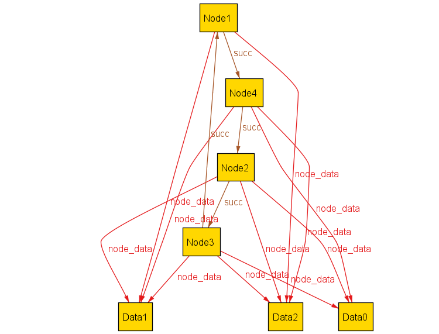
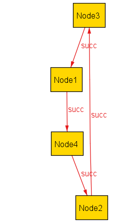

# Description of Model 1

Suppose you are using Alloy to model a simple *ring network* of nodes arranged into a ring structure, where each node can be associated with one or more pieces of data.

The model consists of the following parts:
* the **structural model** describing the static structure of the ring network;
* a set of **invariants** that must be satisfied for a valid ring network; and
* a set of **operations** which can be applied on a ring network, to transform a network state into another.

In this document, we describe how the model is specified. You will use the information in this document to work through a few tasks, each involving an incorrectly-implemented **operation**.

## Structural Model

The structural parts of the model are specified as follows:
- A **network** consists of a set of nodes and a set of data.
- Each node can have a **successor**.
- Each node can **associate with some data**.
  - A piece of data can be associated with multiple nodes, and each node can associate with multiple data.

In Alloy, these structural parts are written as follows:

```
sig Network {
  all_nodes: set Node,
  all_data: set Data,
  succ: Node -> Node,
  node_data: Node -> Data
} {
  succ in all_nodes -> all_nodes
  node_data in all_nodes -> all_data
}
```

In other words, for a network state `net`,
- `net.all_nodes` is the set of all nodes in the network;
- `net.all_data` is the set of all data in the network;
- `net.succ` is the successor relation of the network; and
- `net.node_data` is the association between the nodes and the data in the network.

## Invariants of the Model

Invariants refer to the constraints that all valid network states must satisfy. Here, we provide a list of invariants of our model. Please take your time and focus on understanding the written descriptions, but the Alloy code is also available for your convenience.

For the ring network model, the invariants are:
* Dangling data are disallowed: each piece of data in a network state must be associated with one or more nodes.
* All nodes in the network state are arranged into one and only one ring.

The Alloy specification of these invariants are:
```
pred Invariant [n: Network] {
  // no dangling data
  all data : n.all_data | some (n.node_data).data
  
  // every node has one successor and one predecessor
  all node : n.all_nodes | one node.(n.succ) and one (n.succ).node

  // every node is within some ring
  all node : n.all_nodes | node in node.^(n.succ)

  // all nodes are within the same ring
  all node1, node2: n.all_nodes | node1 in node2.^(n.succ)
}
```

## Operations

We can define **operations** which transform one network state into another. One example of operations is `RemoveAllData`, which would remove all the data from the network.

In our case, operations on network states are implemented as logical constraints between a pre-state (the network state prior to the operation) and a post-state (the network state after the operation). The Alloy implementation of the `RemoveAllData` operation would look like:

```
pred RemoveAllData[net0, net1: Network] {
  // the nodes remain the same
  net1.all_nodes = net0.all_nodes

  // the arrangement between nodes remain the same
  net1.succ = net0.succ

  // all data are removed
  net1.all_data = none

  // any associations between the nodes and data are removed
  net1.node_data = none -> none
}
```

Here, the operation `RemoveAllData[net0, net1]` ensures that `net1` is the same as `net0`, except that all the data in `net0` are removed in `net1`.

## Visualizing Executions of Operations

In this experiment, you will use variants of Alloy visualizations of operation executions to diagnose buggy operations. In this section, we show examples of such visualizations.

For the `RemoveAllData` operation specified above, we can ask Alloy to generate a satisfying instance of executing `RemoveAllData` on a valid ring network (`net0` below).

```
pred RemoveAllDataExample {
  some disj net0, net1: Network |
  Invariant[net0] and RemoveAllData[net0, net1]
}
run RemoveAllDataExample for exactly 2 Network, ...
```

Running this command yields a satisfying instance, which we visualize using Alloy's built-in visualizer, with these theme settings:
* Relations are *projected* over the `Network` sig. That is, when visualizing the execution of an operation, you will see two diagrams, one representing the state of the network before the operation, and one after.
* For each individual diagram representing a single network state `net`, only the nodes in `net.all_nodes` and the data in `net.all_data` are shown. All other nodes and data (those which are not members of the network) are hidden.

Applying these theming settings, one visualization that you may see for the `RemoveAllData` operation is as follows:

* State 0 (before applying the operation):

  
* State 1 (after applying the operation):
  
  

You may also open these pictures up in two different tabs (or side-by-side) in your GitHub codespaces interface. They are at `model1/assets/ex-operation/`.

**Please take your time to understand what this visualization is showing**, before proceeding, because these are the types of visualizations which you will see during the experiment.

If you have any questions, let the researchers know.

Please **let us know when you are ready to proceed**.