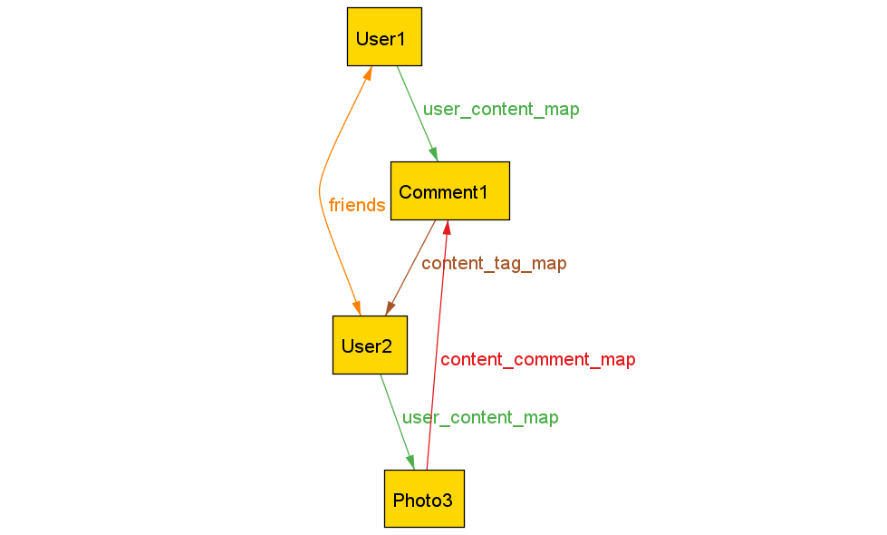
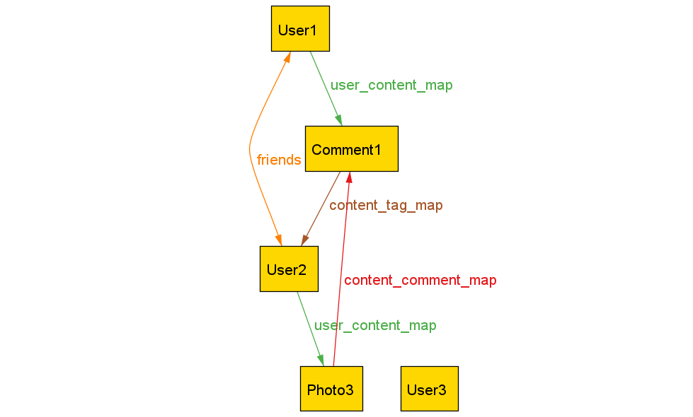

# Description of Model 2
Suppose you are using Alloy to model a simple *social network* consisting of users and contents. The model consists of the following parts:
* the **structural model** describing the static structure of the social network;
* a set of **invariants** that must be satisfied for a valid social network; and
* a set of **operations** which can be applied on a social network state, to transform one network state into another.

In this document, we describe how the model is specified. You will use the information in this document to work through a few tasks, each involving an incorrectly-implemented **operation**.

## Structural Model

The structural parts of the model are defined as follows:
- A **social network** consists of two entities:
  - **Users**, and
  - **Contents**, which can further be splitted into
    - **Photos**, and
    - **Comments**.
- Users can be friends with other users.
- Users can **own** contents.
- Contents can have **tags** to users.
- A user can place a **comment** under a piece of content.
  - Since comments are themselves comments, comments can have comments as well.

In our Alloy model, these structural parts are written as follows:
```
sig SocialNetwork {
  all_users: set User,
  all_photos: set Photo,
  all_comments: set Comment,
  all_contents: set Content,
  friends: User -> User,
  user_content_map : User -> Content,
  content_tag_map : Content -> User,
  content_comment_map : Content -> Comment,
} {
  all_contents = all_photos + all_comments
}

sig User {}

abstract sig Content {}
sig Photo extends Content {}
sig Comment extends Content {}
```

In other words, for a social network `net`,
* `net.all_users` is the set of all users in the social network;
* `net.all_photos` is the set of all photos in the social network;
* `net.all_comments` is the set of all comments in the social network;
* `net.friends` is the friendship relationship between users;
* `net.user_content_map` is the ownership relation between users and contents.
  * For example, if user `u1` owns comment `c1` and photo `p1`, then `u1 -> c1` and `u1 -> p1` will both be inside `net.user_content_map`
* `net.content_tag_map` is the tagging relation between contents and users.
  * For example, if photo `p1` contains a tag to user `u1`, then `p1 -> u1` will be inside `net.content_tag_map`.
* `net.content_comment_map` is the commenting relation between contents and comments.
  * For example, if photo `p1` has a comment `c1`, and comment `c1` has a comment `c2`, then `p1 -> c1` and `c1 -> c2` will both be in `net.content_comment_map`.

## Invariants of the Model

Invariants refer to the constraints that all valid social network states must satisfy. Here, we provide a list of invariants of our model. Please take your time and focus on understanding the written descriptions, but the Alloy code is also available for your convenience.

The invariants of this model are:

**_Well-formedness invariants_**
* All relations (`friends`, `user_content_map`, `content_tag_map`, `content_comment_map`) must refer to existing entities in the social network.
  * For example, the `friends` relation can only refer to existing users.

These rules are encoded as follows:
```
pred wellformedness_invariant [s: SocialNetwork] {
  s.friends in s.all_users -> s.all_users
  s.user_content_map in s.all_users -> s.all_contents
  s.content_tag_map in s.all_contents -> s.all_users
  s.content_comment_map in s.all_contents -> s.all_comments
}
```

**_Friendship invariants_**
* Friendship is symmetric -- if `u1` is a friend of `u2`, then `u2` is a friend of `u1`.
* No self friendship -- `u1` cannot be a friend of `u1`.

These rules are encoded as follows:
```
pred friendship_invariant [s: SocialNetwork] {
  // symmetry
  s.friends = ~(s.friends)
  // no self friendship
  all u: s.all_users | u -> u not in s.friends
}
```

**_Content invariants_**
* Every content (photo or comment) is owned by exactly one existing user.

These rules are encoded as follows:
```
pred content_invariant [s: SocialNetwork] {
  // every content belongs to exactly one user
  s.user_content_map in s.all_users one -> s.all_contents
}
```

**_Tagging invariants_**
* If a content `c` (owned by user `u1`) contains a tag to user `u2`, then `u1` must be a friend of `u2`.

These rules are encoded as follows:
```
pred tagging_invariant [s: SocialNetwork] {
  // can only tag friends
  all u1, u2 : s.all_users, c: s.all_contents | 
    (u1 -> c) in s.user_content_map and 
    (c -> u2) in s.content_tag_map implies 
    (u1 -> u2) in s.friends
}
```

**_Commenting invariants_**
* Every comment must be under exactly one content.
* No comment-loops are allowed.
  * For example, if comment `c1` has a comment `c2`, then `c2` cannot have `c1` as a comment. In general, these types of loops are disallowed.
* If a content `c1` has a comment `c2` under it, then the owner of `c1` must either be the same user as, or be a friend of, the owner of `c2`.

These rules are encoded as follows:
```
pred comment_invariant [s: SocialNetwork] {
  // every comment points to exactly one content
  s.content_comment_map in s.all_contents one -> s.all_comments
  
  // no loops
  all c: s.all_contents | (c -> c) not in ^(s.content_comment_map)

  // only allow friends or oneself to comment on contents
  all u1, u2 : s.all_users, t: s.all_contents, c: s.all_comments |
    (u1 -> c) in s.user_content_map and 
    (u2 -> t) in s.user_content_map and 
    (t -> c) in s.content_comment_map implies
    ((u1 -> u2) in s.friends or u1 = u2)
}
```

# Operations

We can define **operations** which transform one network state into another. An example operation is `AddUser`, which adds a new user to the social network. 

In our case, operations on network states are implemented as logical constraints between a pre-state (the network state prior to the operation) and a post-state (the network state after the operation). The Alloy implementation of the `AddUser` operation would look like:
```
pred AddUser[net0, net1: SocialNetwork, u: User] {
  // precondition: `u` is currently not in the network.
  u not in net0.all_users

  // add `u` into the network.
  net1.all_users = net0.all_users + u
  net1.all_photos = net0.all_photos
  net1.all_comments = net0.all_comments
  net1.all_contents = net0.all_contents
  net1.friends = net0.friends
  net1.user_content_map = net0.user_content_map
  net1.content_tag_map = net0.content_tag_map
  net1.content_comment_map = net0.content_comment_map
}
```
Here, the operation `AddUser[net0, net1, u]` constrains that `net1` is the same as `net0`, except that `net1` has an additional user `u`.

## Visualizing Executions of Operations

In this experiment, you will use variants of Alloy visualizations of operation executions to diagnose buggy operation implementations. In this section, we show examples of such visualizations.

For the `AddUser` operation specified above, we can ask Alloy to generate a satisfying instance of executing `AddUser` on a valid social network state (`net0` below):

```
pred AddUserExample {
  some disj net0, net1: SocialNetwork |
  some disj u: User |
  invariant[net0] and AddUser[net0, net1, u]
}
run AddUserExample for exactly 2 SocialNetwork, ...
```

Running this command yields a satisfying instance, which we visualize using Alloy's built-in visualizer, with these theme settings:
* Relations are *projected* over the `SocialNetwork` sig. That is, when visualizing the execution of an operation, you will see two diagrams, one representing the state of the network before the operation, and one after.
* For each individual diagram representing a single network state `net`, only the users, photos, and comments in the network (that is, in `net.all_users`, `net.all_photos`, or `net.all_comments`) are shown. All other entities (those not in the network) are hidden.

Applying these theming settings, one visualization that you may see for the `AddUser` operation is as follows:

* State 0 (before applying the operation):

  
* State 1 (after applying the operation):
  
  

Please take your time to understand what this visualization is showing, before proceeding.
You may also open these pictures up in two different tabs (or side-by-side) in your GitHub codespaces interface. They are at `model2/assets/ex-operation/`.

**Please take your time to understand what this visualization is showing**, before proceeding, because these are the types of visualizations which you will see during the experiment.

If you have any questions, let the researchers know.

Please **let us know when you are ready to proceed**.